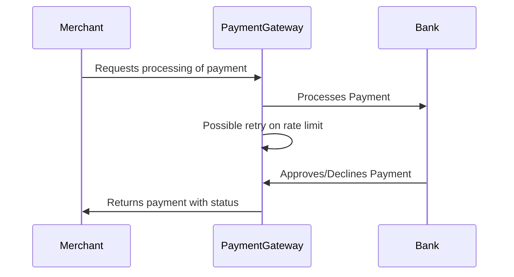
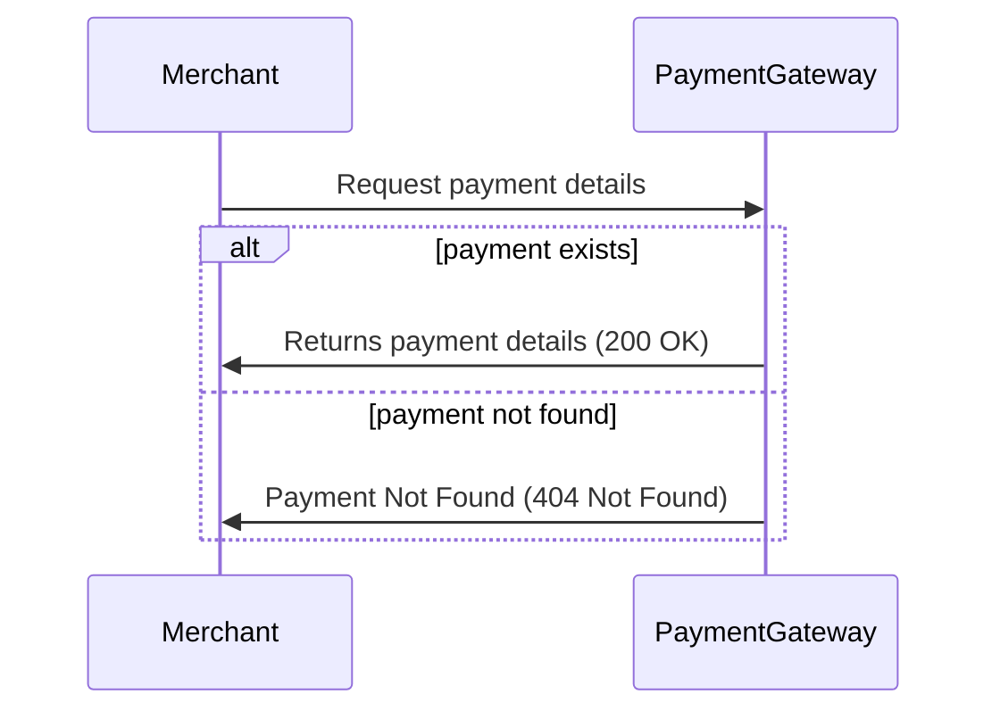

## Payment Gateway

[](https://github.com/KarimDarwish/checkout-payment-gateway/actions/workflows/build-test.yml)
[](https://github.com/KarimDarwish/checkout-payment-gateway/actions/workflows/docker-build.yml)
[](https://github.com/KarimDarwish/checkout-payment-gateway/actions/workflows/swagger-publish.yml)

Swagger API Documentation:
[](https://karimdarwish.github.io/checkout-payment-gateway/)

Content:

* [Setup](#Setup)
* [Architecture](#Architecture)
* [Functionality and Flow](#Overview)
* [Assumptions](#Assumptions)
* [Areas for Improvement](#Areas-for-Improvement)
* [Extra Mile Bonus Points](#Extra-Mile-Bonus-Points)
* [Cloud Technologies](#Cloud-Technologies)

# Setup

The application has been dockerized, only Docker is needed to start it locally.

### Docker Compose

To start the payment gateway using Docker Compose, execute

``docker compose up`` or `docker-compose up` (depending on your Docker version)

in the root directory of the project.

Alternatively, you can start the application with the following command in the root directory of the project:

```
 dotnet run --project .\src\PaymentGateway.API\PaymentGateway.API.csproj
 ```

# Assumptions

Following assumptions have been made:

### Bank

- The bank declines American Express Cards (identified by a 4 digit CVV)
- The bank rate limits the payment gateway occasionally

### Payment Gateway

- Only the length and the expiry date of the credit card is validated, further validations (if they adhere to vendor
  conventions, etc.) is not done in the first iteration
- No merchant/shopper details are required in the initial processing of the payment

# Architecture

<details>
  <summary>Click to expand</summary>

This application uses an onion architecture to structure the projects:

### Domain
This includes all aggregates (e.g. a PaymentAggregate), entities and value objects of the given domain and all its business logic.

It is entirely persistent-ignorant apart from defining an interface for a repository (as per DDD). Still, it has no further information on how the repository or other (non-domain) services are implemented.

The domain layer also does not depend on other projects in this solution; in a more complex project, a reference to e.g. a shared kernel could be established.

### Infrastructure
This layer defines how infrastructure concerns/a communication with the "outside world" is implemented within the application.

For the Payment Gateway, this means implementing the ``IPaymentRepository`` and providing a database for it.

### API
The API project provides the entry point for the API and includes the application logic and concepts like defining and registering services for dependency injection.

</details>

# Functionality and Flow

<details>
  <summary>Click to expand</summary>


## Processing a Payment

```
POST /api/payments
Content-Type: application/json

{
  "amount": 9.90,
  "currency": "USD",
  "creditCard": {
    "cardNumber": "123 123 123 123 1234",
    "expiryMonth": 12,
    "expiryTwoDigitYear": 25,
    "cvv": 123
  }
}
```



Before processing the payment, additional validations are performed on all data passed by the merchant such as:
- Validating format and expiration of the credit card
- Validating format and length of CVV and expiry dates
- Validating the amount of the payment
- Validating that the currency is supported by the payment gateway

Possible responses:

#### 200 OK

If all validations pass, this status code with the payment ID and the status will be returned:

```
{
  "paymentId": "6b45a067-6166-41a2-a544-cda876c36120",
  "status": "Completed"
}
```

#### 400 Bad Request

If any validations fail, the error message will be returned:

```
{
  "message": "The provided credit card number is malformed, expected 16 digits."
}
```


## Getting Payment Details

```
GET /api/payments/{paymentId}
```



Possible responses:

#### 200 OK

Returns the payment details with a masked credit card and no CVV for security purposes.

```
{
  "paymentId": "a4faf2ec-d8b1-45a6-b0b3-649fd4136006",
  "status": "Completed",
  "amount": 9.9,
  "currency": "USD",
  "creditCard": {
    "cardNumber": "*** *** *** *** 1234",
    "expiryMonth": 12,
    "expiryTwoDigitYear": 25
  }
}
```

#### 404 Not Found

Will be returned if the Payment Gateway could not find any payment with the given ID

</details>

# Areas for Improvement

<details>
  <summary>Click to expand</summary>

  Some parts of the application that still need improvement to make it production ready:

### Merchant and Payment Validation

More details about the merchant and the payment are required to ensure the correctness of the payment and prevent any abuse of the payment gateway from unauthorized actors.

Steps like validating the merchant, preventing unwanted duplicate payments and associating a product or a subscription would then be possible.

The same is the case for the API validation; libraries like ``FluentValidation`` allow for a more straightforward validation configuration and can return all validation errors within a request body instead of just the first error that was caught.

### Authentication/Authorization

Adding an authentication/authorization concept (e.g. using JWT provided by an authorization server).

In ASP.NET Core this would be done by leveraging functionality of ``Microsoft.AspNetCore.Authentication`` and
configuring the JWT validation by calling `.AddJwtBearer()`.

An authorization strategy would then ensure that only users with the correct permissions can process payments/view
payment details.

### Multi-Tenancy

At the moment, payments of all tenants are stored alike, and no concept of multi-tenancy is in place.

A more sophisticated setup (depending on the used database technology but, e.g. a database/collection per tenant) would
need to be added to ensure data of multiple tenants is isolated

### Database

In the current state, an in-memory database is used, and no data is made durable outside of the process of the
application.

A production-ready and scalable database would be required to persist payments across the lifetime of the application
and allow us to scale the payment gateway horizontally.

Storing credit card details is a whole separate topic and should only be done by designated services (e.g. Checkout.com) that have the necessary legal (PCI compliance) and security requirements.

### Bank

Currently, the bank is mocked and is deployed as part of the payment gateway. In a real-world scenario, this would be a separate service.

Because of that, additional concerns have to be taken care of when communicating with the bank:

- Method of communication (synchronous/asynchronous)
- How is the Bank API exposed/available to the payment gateway
- Authentication/Authorization of the payment gateway
- Connectivity Issues: Circuit Breaking
- Error Handling


### Observability

While the application exposes metrics, more observability could be implemented that allows for better debugging and future performance improvements down the road.

Having a consistent span across the operation of processing a payment and single spans within different components (Payment Gateway, Bank) would improve the observability of the application.

Other observability concepts that could be added:

- Application Insights, Performance Monitoring and Exception Handling
- Centralized Log Aggregation (Splunk, Grafana Loki, Datadog, etc.)

</details>

# Extra Mile Bonus Points

<details>
  <summary>Click to expand</summary>


## CI

A continuous integration (CI) pipeline has been created using GitHub Actions that performs an automated build and test
on every pull request to the main branch.

Two additional jobs run on every main commit:

- a ``docker-build`` job which attempts to build the docker image (this can be extended to a continuous deployment
  pipeline in the future)
- a ``swagger-publish`` job which uses the `swagger.json` file to build a Swagger UI and publishes it to GitHub Pages

Additional improvements:

- Using multi-stage workflows to facilitate continuous deployment (CD) to different stages
- Using path filters to only trigger specific jobs if the corresponding files change
- Spinning up required dependencies for integration tests if this changes in the future

## Metrics

A ``/metrics`` endpoint has been made available using `prometheus-net` where metrics can be scraped and processed by
observability tools (e.g. Prometheus).

Available metrics are:

- HTTP metrics for every endpoint (request duration, status code, method etc.)
- ``payment_gateway_payments_processed_total``: a counter that increases for every processed payment
- ``payment_gateway_bank_requests_total``: a counter that increases for every request made to the bank
- ``payment_gateway_bank_requests_failed``: a counter that increases for every failed request to the bank (due to the
  bank rate-limiting us)

In production, this endpoint would not be exposed to the public but only be available to internal observability tools.

## Health Checks

Using ASP.NET Core Health Checks, a specific ``/health`` endpoint has been configured to allow for health probes of the
application.

Currently, it is used as a health check within the ``Dockerfile`` to let Docker know whether the application is available
or not.

In the future, this can be improved to:

- including other dependencies (database, message queue, etc.)
- be used as Startup/Readiness/Liveness probe within Kubernetes
- include a ``/ready`` endpoint to differentiate between readiness and liveness

## Fault Tolerance

One assumption that has been made is that we need to take care of rate limits by the bank. These occur randomly in the
mocked bank provided by this project.

To prevent this failure from reaching our merchants, retries using ``Polly`` have been implemented.

The service retries the payment request five times with a delay of 50ms between retries.

This can be extended to:

- use a different backoff strategy to avoid sending too many requests while still being rate limited
- take care of idempotency in requests so that only idempotent requests are retried not to cause any unwanted side
  effects

## Swagger

To document the API of the service, Swagger is being used.

When starting the service in development mode, swagger is available under:

``localhost:5044/swagger``

This is disabled in production builds.

Instead, a ``swagger.json`` file is generated on build time that is used to create and upload a Swagger UI to a GitHub
Pages site.

It is available under: https://karimdarwish.github.io/checkout-payment-gateway/

In the future, Swagger can be used to:

- automatically generate client libraries for clients consuming the API (e.g. frontend, other backend services)

## Hardened Dockerfile

To improve security and harden the environment the application runs in, several measures have been taken:

- A separate (non-root) user is created that runs the application within the container
- An alpine-based image of the .NET runtime is used (fewer known vulnerabilities)
- Port 8080 is used for the service to avoid security issues with a default port 80

Additional steps that can be performed in the future to harden the Docker image:

- using a read-only file system unless required for, e.g. logs
</details>

# Cloud Technologies

<details>
  <summary>Click to expand</summary>

Depending on the planned scale of the Payment Gateway, different approaches to deploying it in the cloud need to be evaluated.

Important factors here are team knowledge, team size, scalability/flexibility requirements and the possibility of dealing with operational overhead.

For a larger-scale project with lots of involved services and complex operational requirements:

- Managed Kubernetes Cluster (Azure AKS, AWS EKS or GKE)
- Managed database, depending on the chosen technology (DynamoDB, RDS, CosmosDB, etc.)
- A separate way to store credit card information (only done by the Payment Gateway if it is PCI certified and can handle encryption/security requirements)

For a smaller scale deployment of the Payment Gateway:

- Serverless (Azure Functions, AWS Serverless or Google Cloud Functions)
- Managed database (DynamoDB, RDS, CosmosDB, etc.)

The serverless setup allows for great scalability and elasticity, and while it introduces some challenges (cold start, environment variables, communication), they make sense for small-scale deployments of services.
</details>